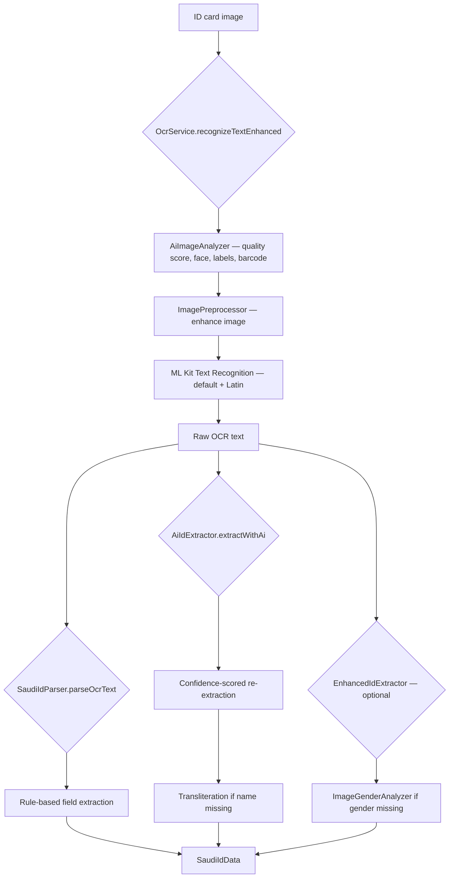
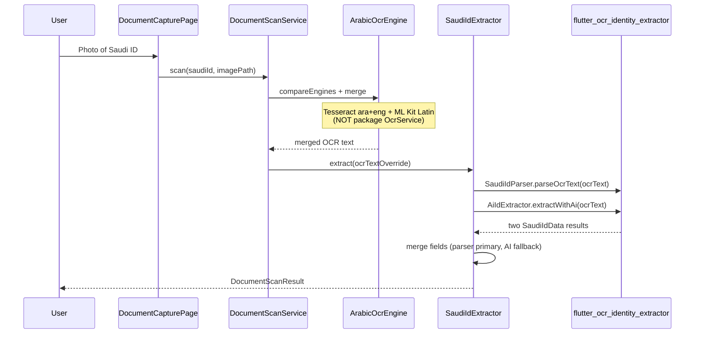

# flutter_ocr_identity_extractor — How It Works

Package: **flutter_ocr_identity_extractor** v1.2.0 (pub.dev)  
Purpose: On-device Saudi National ID extraction — OCR, image analysis, and structured field parsing.

This document describes the package’s internal flow and how **this app** uses it.

---

## What the package does

The package is built around **Saudi National ID cards**. It can:

1. Run OCR on an ID card image (via its own `OcrService`)
2. Analyze image quality before OCR (brightness, sharpness, face detection)
3. Preprocess/enhance images for better OCR
4. Parse raw OCR text into structured Saudi ID fields
5. Score extraction confidence and fill missing Arabic/English names via transliteration
6. Optionally detect gender from the card photo (face analysis)

It is **not** a general Arabic document parser — it is specialized for Saudi IDs.

---

## Package dependencies (what it uses internally)

| Dependency | Role inside the package |
|------------|-------------------------|
| **google_mlkit_text_recognition** | Primary OCR — default recognizer + Latin script recognizer |
| **google_mlkit_image_labeling** | Detects if image likely contains an ID card |
| **google_mlkit_face_detection** | Face detection for quality checks and gender analysis |
| **google_mlkit_barcode_scanning** | Scans barcodes on the card |
| **image** | Image decode, resize, brightness/contrast/sharpen preprocessing |
| **arabic_name_transliterator** | Converts Arabic ↔ English names when one is missing |
| **logger** | Debug logging throughout parsing and OCR |

---

## Public API surface

The package exports these main building blocks:

| Component | Type | Responsibility |
|-----------|------|----------------|
| **OcrService** | Singleton | Image → OCR text (basic or enhanced pipeline) |
| **SaudiIdParser** | Singleton | OCR text → `SaudiIdData` (rule/regex parsing) |
| **AiIdExtractor** | Singleton | OCR text → `SaudiIdData` with confidence scoring |
| **EnhancedIdExtractor** | Singleton | Parser + image-based gender fallback |
| **AiImageAnalyzer** | Singleton | Pre-OCR image quality and content analysis |
| **ImagePreprocessor** | Singleton | Brightness, contrast, sharpen, resize |
| **ImageGenderAnalyzer** | Singleton | Gender from face on card photo |
| **ArabicTransliterator** | Utility | Arabic name ↔ English name |
| **SaudiIdData** | Model | Parsed result (names, ID number, dates, gender, card type) |

---

## Full package flow (image → structured data)

This is the **intended end-to-end path** when using the package on its own:

### Step 1 — Enhanced OCR (`OcrService`)

When `recognizeTextEnhanced` is called on an image file:

| Step | Component | What happens |
|------|-----------|--------------|
| 1 | **AiImageAnalyzer** | Scores image quality (0–100), detects face, labels content, scans barcodes, suggests retake tips |
| 2 | **ImagePreprocessor** | Auto-orients, resizes (max 2000px), adjusts brightness/contrast, sharpens, reduces noise |
| 3 | **ML Kit OCR** | Runs **two recognizers in parallel**: default script + Latin script |
| 4 | **Text merge** | Combines unique lines from both recognizers into one string |
| 5 | **Cleanup** | Deletes temporary processed image file |

Returns: `{ text, analysis, enhanced }`

Simpler alternatives exist: `recognizeTextFromImage`, `recognizeTextFromPath` — OCR only, no preprocessing.

### Step 2 — Saudi ID parsing (`SaudiIdParser`)

Takes **raw OCR text** (not an image) and extracts fields using layered strategies:

| Field | Extraction approach |
|-------|---------------------|
| **Identity number** | Arabic label `الرقم`, English `No:`, standalone 10-digit patterns; supports Arabic-Indic and Persian digits |
| **Arabic name** | Long Arabic sequences, `بن`/`بنت` patterns, line-by-line scan, excluded-word filtering |
| **English name** | Uppercase comma-separated lines (e.g. `AL RASHID, MOHAMMED`) |
| **Date of birth** | `DOB`, `تاريخ الميلاد`, Gregorian and Hijri dates (Hijri converted to Gregorian) |
| **Date of expiry** | `DOE`, `تاريخ الانتهاء` |
| **Place of birth** | Text after `مكان الميلاد` |
| **Gender** | `بن`/`بنت` in name, or M/F/Male/Female/ذكر/أنثى in text |
| **Card type** | Keywords: مواطن (citizen), مقيم (resident), زائر (visitor) |

**Name fallback:** If only Arabic or only English name is found, `ArabicTransliterator` fills the missing one.

**Output:** `SaudiIdData` with all fields + `IdCardType` enum.

### Step 3 — AI extraction (`AiIdExtractor`)

Not a separate ML model — it **wraps `SaudiIdParser`** and adds:

- Per-field **confidence scores** (0.0–1.0)
- Multiple regex candidates ranked by confidence
- Same transliteration fallback for missing names
- Returns a single best `SaudiIdData` merged from high-confidence picks + parser base data

### Step 4 — Enhanced extraction (`EnhancedIdExtractor`) — optional

Used when you also pass the **image file**:

1. Runs `SaudiIdParser` on OCR text
2. If gender is missing → **ImageGenderAnalyzer** analyzes the face on the card photo
3. Additional text-based gender heuristics as last resort

---

## SaudiIdData output model

| Field | Description |
|-------|-------------|
| `arabicName` | Full Arabic name |
| `englishName` | Uppercase English name |
| `identityNumber` | 10-digit Saudi ID number |
| `dateOfBirth` | DD/MM/YYYY (Gregorian) |
| `dateOfExpiry` | DD/MM/YYYY |
| `placeOfBirth` | Arabic place name |
| `gender` | `M` or `F` |
| `cardType` | `citizen`, `resident`, `visitor`, or `unknown` |

---

## How this app uses the package

This app uses **only the parsing layer** — not the package’s OCR pipeline.

### What we use

| Package API | Used? | Role in this app |
|-------------|-------|------------------|
| **SaudiIdParser** | Yes | Primary rule-based field extraction |
| **AiIdExtractor** | Yes | Secondary pass with confidence scoring; fills gaps |
| **OcrService** | **No** | Avoided — crashes on second scan (singleton AI analyzer dispose issue) |
| **AiImageAnalyzer** | No | Only called internally by `OcrService` |
| **ImagePreprocessor** | No | Only called internally by `OcrService` |
| **EnhancedIdExtractor** | No | Not wired in |
| **ImageGenderAnalyzer** | No | Not wired in |

### Merge strategy in `SaudiIdExtractor`

The app runs **both** parsers on the same OCR text, then merges:

- **Primary:** `SaudiIdParser` result
- **Fallback:** `AiIdExtractor` result — any field the parser missed
- **Card type:** Parser value wins unless it is `unknown`, then AI value is used

OCR text itself comes from **`ArabicOcrEngine`** (Tesseract `ara+eng` + ML Kit Latin), not from the package.

---

## Why OcrService is not used here

The package’s `OcrService.recognizeTextEnhanced` path:

1. Initializes `AiImageAnalyzer` (ML Kit image labeling, face detection, barcode scanning)
2. On `dispose()`, tears down the analyzer
3. **Cannot be safely re-initialized** on a second scan in the same app session

Because of this, `ArabicOcrEngine` handles all OCR externally and passes plain text into the package parsers.

---

## Package flow vs app flow — comparison

| Stage | Package alone | This app |
|-------|---------------|----------|
| Image input | `File` / path / bytes | `image_picker` → file path |
| Pre-OCR analysis | `AiImageAnalyzer` | Skipped |
| Image enhancement | `ImagePreprocessor` | Skipped |
| OCR | ML Kit (default + Latin) via `OcrService` | Tesseract `ara+eng` + ML Kit Latin via `ArabicOcrEngine` |
| Parsing | `SaudiIdParser` / `AiIdExtractor` | Same — both called |
| Gender from photo | `EnhancedIdExtractor` + `ImageGenderAnalyzer` | Not used — gender from text only |
| Output | `SaudiIdData` | Mapped to `DocumentScanResult.fields` |

---

## Parsing strategy summary (inside SaudiIdParser)

For each field the parser tries multiple strategies in order:

1. **Labeled extraction** — find Arabic/English label, read value after it (highest reliability)
2. **Pattern matching** — regex for numbers, dates, names across full text
3. **Line-by-line scan** — iterate cleaned OCR lines with exclusion filters
4. **Context heuristics** — e.g. date of birth = date with year &lt; current year − 10
5. **Transliteration fallback** — derive missing name from the one that was found
6. **Aggressive fallback** — looser Arabic text sequences when standard patterns fail

Digit handling supports three numeral systems: Western (0–9), Arabic-Indic (٠–٩), and Persian (۰–۹).

---

## Related files in this project

| File | Relationship to package |
|------|-------------------------|
| `lib/features/arabic_document_scan/data/saudi_id_extractor.dart` | Calls `SaudiIdParser` + `AiIdExtractor` |
| `lib/features/arabic_document_scan/data/document_scan_service.dart` | Routes Saudi ID scans to `SaudiIdExtractor` |
| `lib/features/arabic_document_scan/data/arabic_ocr_engine.dart` | Provides OCR text instead of package `OcrService` |

---

## Quick reference

| Question | Answer |
|----------|--------|
| What does the package OCR with? | Google ML Kit Text Recognition (default + Latin) |
| What does the package parse? | Saudi National ID fields from OCR text |
| What does this app use from it? | `SaudiIdParser` + `AiIdExtractor` only |
| Where does OCR text come from in this app? | `ArabicOcrEngine` (Tesseract + ML Kit) |
| Why not use package OCR? | `OcrService` crashes on repeated scans after dispose |
