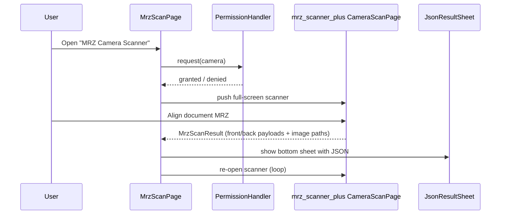
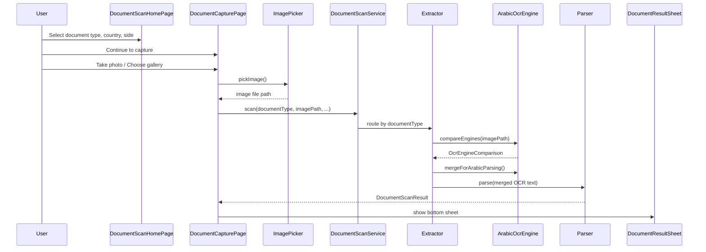

# OCR App — Full Flow & Packages

This document describes the end-to-end scanning flows in the **mrz** Flutter app, the packages involved at each step, and how data moves through the layers.

---

## Overview

The app exposes **two scanning modes** from the home screen:

| Mode | Entry point | Primary use |
|------|-------------|-------------|
| **MRZ Camera Scanner** | `MrzScanPage` | Live camera capture of passport / ID MRZ bands via `mrz_scanner_plus` |
| **Arabic Document Scanner** | `DocumentScanHomePage` → `DocumentCapturePage` | Photo/gallery capture + on-device OCR + country-specific field parsing |

Both modes run fully on-device. No network calls are required for scanning.

---

## Packages

### Runtime dependencies

| Package | Version | Role in this app |
|---------|---------|------------------|
| **flutter** | SDK | UI framework |
| **cupertino_icons** | ^1.0.8 | iOS-style icons |
| **mrz_scanner_plus** | git: `https://github.com/ahmedkubur/mrz-scanner.git` | Live MRZ camera scanner (`CameraScanPage`), static-image MRZ extraction (`MrzScanResultBuilder`) |
| **flutter_bloc** | ^9.1.1 | Listed in `pubspec.yaml` (not used in current scan flows) |
| **equatable** | ^2.0.7 | Listed in `pubspec.yaml` (not used in current scan flows) |
| **auto_route** | ^11.1.0 | Declarative navigation (`AppRouter`, `@RoutePage`) |
| **get_it** | ^8.2.0 | Service locator (`locator`) |
| **injectable** | ^2.5.2 | DI code generation for `@lazySingleton` services |
| **permission_handler** | ^12.0.1 | Camera and photo-library permissions |
| **image_picker** | ^1.1.2 | Capture photo from camera or pick from gallery |
| **flutter_tesseract_ocr** | ^0.4.31 | On-device Tesseract OCR (`ara+eng`) |
| **google_mlkit_text_recognition** | ^0.15.1 | On-device ML Kit Latin script OCR |
| **flutter_ocr_identity_extractor** | ^1.2.0 | Saudi ID parsing (`SaudiIdParser`, `AiIdExtractor`) — OCR text only, not its `OcrService` |

### Dependency overrides (ML Kit family alignment)

| Package | Version |
|---------|---------|
| `google_mlkit_text_recognition` | ^0.15.1 |
| `google_mlkit_commons` | ^0.11.0 |
| `google_mlkit_image_labeling` | ^0.14.0 |
| `google_mlkit_face_detection` | ^0.13.0 |
| `google_mlkit_barcode_scanning` | ^0.14.0 |

### Dev dependencies

| Package | Role |
|---------|------|
| **flutter_test** | Widget/unit tests |
| **flutter_lints** | Lint rules |
| **build_runner** | Code generation runner |
| **auto_route_generator** | Generates `router.gr.dart` |
| **injectable_generator** | Generates `injection.config.dart` |
| **flutter_launcher_icons** | App icon generation |

### Bundled assets

| Asset | Purpose |
|-------|---------|
| `assets/tessdata/ara.traineddata` | Arabic Tesseract model |
| `assets/tessdata/eng.traineddata` | English Tesseract model |
| `assets/tessdata_config.json` | Tells `flutter_tesseract_ocr` which traineddata files to bundle |

---

## App bootstrap

```
main()
  → WidgetsFlutterBinding.ensureInitialized()
  → configureDependencies()          // get_it + injectable
  → runApp(MyApp)
       → MaterialApp.router
            → AppRouter (auto_route)
```

**DI-registered services** (`injection.config.dart`):

- `ArabicOcrEngine`
- `SaudiIdExtractor`
- `GenericArabicExtractor`
- `PassportMrzExtractor`
- `DocumentScanService` (orchestrator)

---

## Navigation map

```
AppHomePage (initial)
├── MRZ Camera Scanner        → MrzScanPage
└── Arabic Document Scanner   → DocumentScanHomePage
                                  └── DocumentCapturePage
```

Routes are defined in `lib/core/UI/routes/router.dart` and generated into `router.gr.dart`.

---

## Flow 1 — MRZ Camera Scanner

Used for live camera scanning of MRZ bands (passport data page or ID card back).



### Steps

1. **`MrzScanPage`** requests camera permission via `permission_handler`.
2. Opens **`CameraScanPage`** from **`mrz_scanner_plus`**.
3. On successful scan, the callback receives:
   - `frontPayload` / `backPayload` — parsed MRZ JSON maps
   - `frontSavedPath` / `backSavedPath` — saved image file paths
4. Wraps the result in **`MrzScanResult`** and displays **`JsonResultSheet`**.
5. After dismissing the sheet, the scanner re-opens automatically for the next scan.

### Package involvement

| Step | Package |
|------|---------|
| Camera permission | `permission_handler` |
| Live MRZ detection & parsing | `mrz_scanner_plus` |
| Result display | Flutter Material (`JsonResultSheet`) |

---

## Flow 2 — Arabic Document Scanner

Used for Saudi ID, Arabic national IDs, and passports via photo capture or gallery import.



### Step 1 — Document selection (`DocumentScanHomePage`)

User picks:

| Setting | Options |
|---------|---------|
| **Document type** | `saudiId`, `arabicId`, `passport` |
| **Country** | Sudan (`sd`), UAE (`ae`) — hidden for Saudi ID |
| **ID card side** | Front / Back — only for Sudan `arabicId` |

### Step 2 — Image capture (`DocumentCapturePage`)

| Package | Usage |
|---------|-------|
| `permission_handler` | `Permission.camera` or `Permission.photos` |
| `image_picker` | `ImagePicker().pickImage(source: camera \| gallery, imageQuality: 90)` |

### Step 3 — Orchestration (`DocumentScanService.scan`)

Routes by `DocumentType`:

| Document type | Handler | Notes |
|---------------|---------|-------|
| `saudiId` | `SaudiIdExtractor` | Dual OCR first, then Saudi-specific parsing |
| `passport` | `PassportMrzExtractor` | Sudan: OCR + MRZ; others: MRZ-only from image |
| `arabicId` | `GenericArabicExtractor` | Dual OCR + country parser |

---

## OCR pipeline (`ArabicOcrEngine`)

The core on-device OCR layer used by Saudi ID, Arabic ID, and Sudan passport flows.

**Does not use** `OcrService.recognizeTextEnhanced` from `flutter_ocr_identity_extractor` — that singleton crashes on a second scan after dispose.

### Dual-engine strategy

```
imagePath
    ├── ML Kit (google_mlkit_text_recognition)
    │     └── TextRecognizer(script: latin)
    │           → English names, numbers, MRZ-like Latin text
    │
    └── Tesseract (flutter_tesseract_ocr)
          └── language: ara+eng, psm: 3
                → Arabic script + English
```

### Merge logic (`mergeForArabicParsing`)

1. Clean Tesseract output (normalize Arabic, drop empty lines).
2. If Tesseract has text → use it as primary.
3. If ML Kit also has text → merge unique lines from both engines.
4. If Tesseract is empty → fall back to ML Kit only.

### Debug logging (`ocr_debug_log.dart`)

Before parsing, `logRawOcrBeforeParsing()` prints to the debug console:

- Tesseract raw text + char count
- ML Kit raw text + char count
- Merged text sent to the parser
- Per-engine timing (`mlKitDurationMs`, `tesseractDurationMs`)

---

## Extraction & parsing by document type

### Saudi National ID (`DocumentType.saudiId`)

```
ArabicOcrEngine.compareEngines()
  → mergeForArabicParsing()
  → SaudiIdExtractor.extract()
       ├── SaudiIdParser.instance.parseOcrText()     // flutter_ocr_identity_extractor
       └── AiIdExtractor.instance.extractWithAi()    // flutter_ocr_identity_extractor
       → merge both SaudiIdData results
```

**Extracted fields:** `arabicName`, `englishName`, `identityNumber`, `dateOfBirth`, `dateOfExpiry`, `placeOfBirth`, `gender`, `cardType`

### Arabic Country ID (`DocumentType.arabicId`)

```
ArabicOcrEngine → merged OCR text
  → CountryParserFactory / specialized parser
```

| Country | Side | Parser | Package extras |
|---------|------|--------|----------------|
| Sudan (`sd`) | Front | `SudanIdFrontParser` | Label/regex parsing via `ParserUtils` |
| Sudan (`sd`) | Back | `SudanIdBackParser` | OCR labels + `MrzScanResultBuilder.buildBackMrzPayloadFromImage` (`mrz_scanner_plus`) |
| UAE (`ae`) | Front | `UaeIdParser` | Emirates ID format `784-XXXX-XXXXXXX-X` |
| Other | Front | `GenericArabicIdParser` | Heuristic Arabic/English name, ID number, DOB extraction |

**Sudan front fields:** `arabicName`, `nationalNumber`, `dateOfBirth`, `placeOfBirth`, `bloodType`, `profession`, `address`, `phone`

**Sudan back fields:** `serialNumber`, `englishName`, `placeOfIssue`, `issueDate`, `expiryDate`, `dateOfBirth`, `sex`, `nationality` (+ raw `mrzResult`)

**UAE fields:** `idNumber`, `arabicName`, `englishName`, `dateOfBirth`, `nationalityArabic`, `nationalityEnglish`, `issuingDate`, `expiryDate`, `sex`

### Passport (`DocumentType.passport`)

| Country | Flow |
|---------|------|
| Sudan (`sd`) | `ArabicOcrEngine` → `SudanPassportParser` (OCR labels + `MrzScanResultBuilder.buildPassportPayloadFromImage`) |
| Other | `MrzScanResultBuilder.buildPassportPayloadFromImage` only (no dual OCR) |

**Sudan passport fields:** `passportType`, `countryCode`, `passportNumber`, `fullNameEnglish`, `fullNameArabic`, `nationalityEnglish`, `nationalityArabic`, `nationalNumber`, `placeOfBirthEnglish`, `placeOfBirthArabic`, `dateOfBirth`, `sex`, `issueDate`, `placeOfIssueEnglish`, `placeOfIssueArabic`, `expiryDate`, `surname`, `givenNames`

**Generic passport fields:** `documentNumber`, `issueDate`, `expiryDate`, `surname`, `givenNames`, `nationality`, `dateOfBirth`, `sex`, `documentType`

---

## Parser utilities (`ParserUtils`)

Shared helpers in `lib/features/arabic_document_scan/data/parsers/parser_utils.dart`:

- `normalizeArabic` / `normalizeDigits` — Arabic digit → Western digit conversion
- `rawLines` — split and trim OCR text into lines
- `extractLabeledValue` — find field values after Arabic/English labels
- `extractDate` — date extraction near known label keywords
- `extractGender` — M/F from Arabic or English tokens
- `extractEnglishNameLine` — Latin name line detection
- `collectWarnings` — flag missing required fields

---

## Result models

### `DocumentScanResult`

Returned by all Arabic document scan paths. Contains:

- `documentType`, `countryCode`
- `fields` — parsed key/value map
- `rawOcrText` — merged OCR text sent to parser
- `imagePath` — source image file
- `mrzResult` — raw MRZ JSON (passport / Sudan ID back)
- `warnings` — missing-field or MRZ failure messages
- `ocrComparison` — per-engine text and timing
- `scannedAt` — timestamp

Displayed in **`DocumentResultSheet`** with toggles for raw OCR text and engine comparison.

### `MrzScanResult`

Returned by the live MRZ camera flow. Contains `frontPayload`, `backPayload`, and saved image paths. Displayed as JSON in **`JsonResultSheet`**.

---

## Layer architecture

```
Presentation
├── AppHomePage
├── MrzScanPage
├── DocumentScanHomePage
├── DocumentCapturePage
├── DocumentResultSheet
└── JsonResultSheet

Domain
├── DocumentType
├── ArabicCountry
├── IdCardSide
├── DocumentScanResult / OcrEngineComparison
└── MrzScanResult

Data
├── DocumentScanService          ← entry point for photo-based scans
├── ArabicOcrEngine              ← Tesseract + ML Kit
├── SaudiIdExtractor
├── GenericArabicExtractor
├── PassportMrzExtractor
└── parsers/
    ├── CountryParserFactory
    ├── SudanIdFrontParser
    ├── SudanIdBackParser
    ├── SudanPassportParser
    ├── UaeIdParser
    ├── GenericArabicIdParser
    └── ParserUtils

Core
├── injection.dart / injection.config.dart   (get_it + injectable)
└── router.dart / router.gr.dart             (auto_route)
```

---

## Package → feature matrix

| Feature | Packages |
|---------|----------|
| App navigation | `auto_route` |
| Dependency injection | `get_it`, `injectable` |
| Permissions | `permission_handler` |
| Photo input | `image_picker` |
| Arabic OCR | `flutter_tesseract_ocr`, `google_mlkit_text_recognition` |
| Saudi ID field extraction | `flutter_ocr_identity_extractor` |
| MRZ scan (camera + static image) | `mrz_scanner_plus` |
| Result UI | Flutter Material |

---

## File index (key paths)

| Path | Purpose |
|------|---------|
| `lib/main.dart` | App entry, DI init, router setup |
| `lib/core/config/injection.dart` | GetIt locator |
| `lib/core/UI/routes/router.dart` | Route definitions |
| `lib/features/home/presentation/pages/app_home_page.dart` | Mode selection |
| `lib/features/mrz_scan/presentation/pages/mrz_scan_page.dart` | Live MRZ scanner |
| `lib/features/arabic_document_scan/presentation/pages/document_scan_home_page.dart` | Document type/country picker |
| `lib/features/arabic_document_scan/presentation/pages/document_capture_page.dart` | Camera/gallery capture |
| `lib/features/arabic_document_scan/data/document_scan_service.dart` | Scan orchestrator |
| `lib/features/arabic_document_scan/data/arabic_ocr_engine.dart` | Dual OCR engine |
| `lib/features/arabic_document_scan/data/saudi_id_extractor.dart` | Saudi ID parsing |
| `lib/features/arabic_document_scan/data/generic_arabic_extractor.dart` | Arabic ID routing |
| `lib/features/arabic_document_scan/data/passport_mrz_extractor.dart` | Passport routing |
| `lib/features/arabic_document_scan/data/parsers/` | Country-specific parsers |
| `assets/tessdata/` | Tesseract language models |
